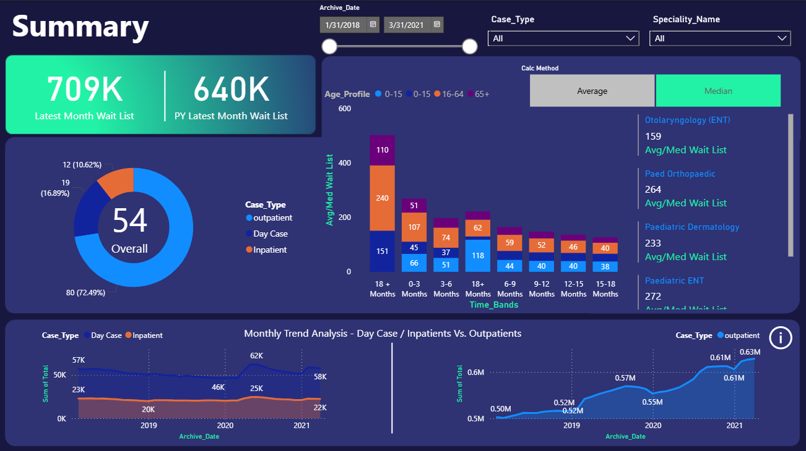
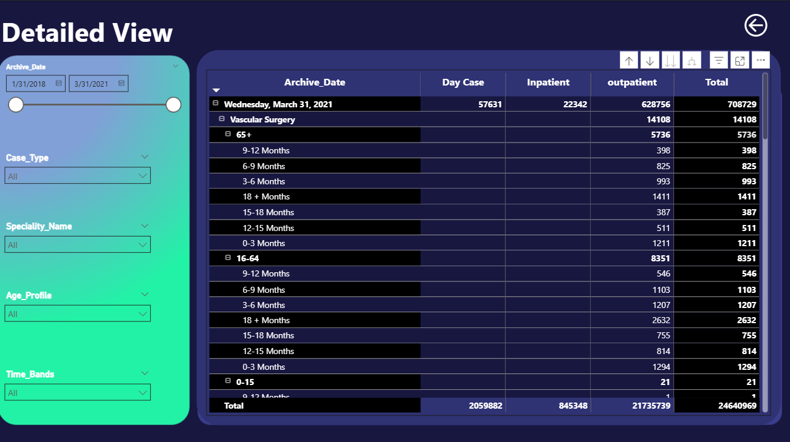

# Healthcare Patient Waitlist Dashboard

## 📊 Project Overview

An interactive Power BI dashboard analyzing healthcare patient wait lists across multiple specialties, providing insights into both inpatient and outpatient waiting times from 2018 to 2021.

## 🎯 Objectives

1. **Track Current Status** - Monitor the current state of patient waiting lists
2. **Historical Analysis** - Analyze monthly trends in inpatient and outpatient waiting lists
3. **Detailed Insights** - Provide specialty-level and age profile analysis

## 📈 Key Metrics

- **Average & Median Waiting List** - Statistical measures of wait times
- **Current Total Wait List** - Real-time snapshot of waiting patients
- **Case Type Breakdown** - Distribution across Day Case, Inpatient, and Outpatient
- **Specialty Analysis** - Wait times by medical specialty
- **Age Profile Distribution** - Waiting list segmentation by age groups

## 🛠️ Tools & Technologies

- **Power BI Desktop** - Dashboard development
- **Data Modeling** - Relationships and calculated measures
- **DAX** - Custom calculations and metrics
- **Power Query** - Data transformation

## 🖼️ Dashboard Views

### Summary Page

**Key Features:**
- Overall wait list metrics (709K latest month, 640K PY latest month)
- 54-day overall average wait time
- Case type distribution (72.49% Outpatient, 16.89% Inpatient, 10.62% Day Case)
- Age profile visualization across time bands
- Monthly trend analysis (2019-2021)
- Top specialties by average wait time

### Detailed View

**Key Features:**
- Date range filtering (1/31/2018 - 3/31/2021)
- Drill-down by Case Type, Specialty, Age Profile, and Time Bands
- Granular data table with hierarchical breakdown
- Specialty-specific analysis (Vascular Surgery, ENT, etc.)
- Total metrics: 24.6M total cases across the period

## 📊 Data Scope

- **Time Period**: 2018 - 2021
- **Data Source**: Healthcare Patient Wait List
- **Categories**: Inpatients & Outpatients
- **Specialties**: Multiple medical specialties including Otolaryngology (ENT), Paediatric Orthopaedics, Paediatric Dermatology, Paediatric ENT, Vascular Surgery, and more

## 💡 Features

- ✅ Interactive filtering and slicing
- ✅ Time-based trend analysis
- ✅ Drill-down capabilities
- ✅ Multiple visualization types
- ✅ Age profile segmentation
- ✅ Specialty comparison
- ✅ Calculation method toggle (Average/Median)
